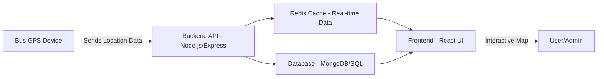

# 🚌 Real-Time Bus Tracking System  

A full-stack web application that enables **real-time tracking of buses**, providing live location updates, route monitoring, and user-friendly management features. Designed with scalability, performance, and reliability in mind, the system ensures seamless communication between backend services and the frontend UI.  

---

## 🚀 Features  

### 👥 User Features  
- View buses in real-time on an interactive map.  
- Get live updates on bus location, route, and status.  
- Responsive and mobile-friendly interface.  

### 🛠️ Admin Features  
- Add, update, and manage buses and routes.  
- Manage users and assign roles (admin, operator, passenger).  
- Monitor bus availability and operational status.  

### ⚡ Technical Features  
- Real-time location streaming with **Redis in-memory caching** for ultra-fast updates.  
- **JWT-based authentication** for secure user and admin access.  
- **RESTful APIs** for bus data, routes, and live location.  
- Modular and scalable architecture for handling high traffic.  

---

## 🏗️ Tech Stack  

### **Frontend**  
- React.js (with Hooks & Context API/Redux if used)  
- TailwindCSS / CSS for styling  
- Interactive Maps (e.g., Leaflet.js or Google Maps API)  

### **Backend**  
- Node.js & Express.js  
- Redis (for caching real-time location data)  
- MongoDB / SQL (for persistent storage of buses, routes, and users)  

### **Authentication & Security**  
- JWT (JSON Web Tokens) for authentication  
- Role-based access control (Admin/User)  

---

## 🔧 Architecture Overview  



- Location data is ingested by the backend.  
- Redis caches live bus data for fast retrieval.  
- Persistent information (buses, routes, users) is stored in the database.  
- Frontend fetches live data via APIs and updates maps in real time.  

---

## ⚙️ Installation & Setup  

### 1️⃣ Clone Repository  
```bash
git clone https://github.com/your-username/real-time-bus-tracking.git
cd real-time-bus-tracking
```

### 2️⃣ Setup Backend  
```bash
cd backend
npm install
```
Create `.env` file inside backend:  
```env
PORT=5000
MONGO_URI=your_mongodb_connection_string
REDIS_URL=redis://localhost:6379
JWT_SECRET=your_secret_key
```
Run backend:  
```bash
npm start
```

### 3️⃣ Setup Frontend  
```bash
cd frontend
npm install
npm run dev
```

### 4️⃣ Access App  
Open: `http://localhost:3000`  

---

## 🧑‍💻 API Endpoints  

| Method | Endpoint              | Description                     | Auth Required |
|--------|-----------------------|---------------------------------|---------------|
| POST   | `/api/auth/register`  | Register new user               | No            |
| POST   | `/api/auth/login`     | Login and get JWT               | No            |
| GET    | `/api/buses`          | Get all buses with live status  | Yes           |
| POST   | `/api/buses`          | Add a new bus                   | Admin Only    |
| PUT    | `/api/buses/:id`      | Update bus details              | Admin Only    |
| DELETE | `/api/buses/:id`      | Delete bus                      | Admin Only    |
| GET    | `/api/routes`         | Get all routes                  | Yes           |

---

## 🚀 Future Enhancements  
- Push notifications for bus arrivals/delays.  
- Advanced analytics dashboard for admins.  
- Integration with IoT sensors (fuel, engine status).  

---

## 📜 License  
This project is licensed under the **MIT License**.  
