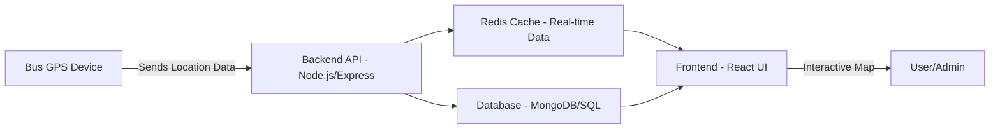

# 🚌✨ SmartLink — Your Bus, Your Way!


Say goodbye to waiting and hello to **smart commuting** with **SmartLink**! 🚀  

📍 **Live Bus Tracking** — Know exactly where your bus is, in real-time.  
🗺️ **Route Monitoring** — Plan your ride, avoid delays, and stay ahead.  
📲 **User-Friendly Interface** — Smooth, simple, and super intuitive.  
⚡ **Fast & Reliable** — Built for speed, performance, and zero stress.  

Hop on, track it, ride smart — **SmartLink makes every commute effortless!** 🎉🚌💨


## 🚀 SmartLink Features

### 👥 For Users (Passengers)
- 🗺️ **Track Buses Live** – Watch all buses move in real-time on an interactive map.  
- 🔔 **Instant Updates** – Receive notifications about bus location, route changes, and arrival times.  
- 📱 **Smooth Experience** – Fully responsive and mobile-friendly; check your commute anytime, anywhere.  

### 🛠️ For Admins & Operators
- ➕ **Manage Buses & Routes** – Easily add new buses, update routes, and keep everything organized.  
- 👥 **User & Role Management** – Assign roles like admin, operator, or passenger, and control access.  
- 📊 **Monitor Operations** – Track bus availability, status, and performance in real-time to keep things running smoothly.

### ⚡ Technical Features — What Makes SmartLink Unique  

- ⏱️ **Smart ETA Predictions** – Our AI-powered model predicts bus arrival times using historical data. No more waiting, no more guessing!  
- 🚀 **Real-Time Location Streaming** – Lightning-fast updates powered by **Redis 🟢** in-memory caching. Track buses live with zero lag.  
- 🗺️ **Interactive Maps** – Sleek, user-friendly maps built with **Leaflet 🟦**, showing buses moving in real-time.  
- 🔒 **Secure Authentication** – **Firebase 🔥** ensures safe logins for passengers, operators, and admins.  
- 🌐 **RESTful APIs** – Smooth delivery of bus data, routes, and live locations for a seamless experience.  
- 🏗️ **Modular & Scalable Architecture** – Built to handle high traffic with ease, ready for growth and expansion.  

---

### 🚀 Why SmartLink Stands Out
SmartLink isn’t just a bus tracker — it’s a **full smart commuting experience**:  
- ⚡ **Faster Updates**  
- 🎯 **Accurate ETAs**  
- 🚌 **Real-Time Tracking**  
- 🌟 **Intuitive, user-friendly interface**  

SmartLink combines **speed, intelligence, and reliability** to make every ride smooth, stress-free, and smarter than ever! 🎉💨


## 🏗️ SmartLink Tech Stack  

SmartLink is built with **modern, reliable, and scalable technologies** to deliver seamless real-time bus tracking. 🚍💨  

---

### 🖥️ **Frontend**
-  **React.js** – Dynamic UI with Hooks & Context API / Redux  
-  **TailwindCSS / CSS** – Sleek, responsive styling  
-  **Leaflet.js** /  **Google Maps API** – Interactive live maps  

### 🛠️ **Backend**
-  **Node.js** &  **Express.js** – Fast, scalable server-side logic  
-  **Redis** – Real-time caching for lightning-fast updates  
-  **MongoDB** /  **SQL** – Persistent storage for buses, routes, and users  

### 🔒 **Authentication & Security**
-  **JWT** – Secure authentication for all users  
- 👥 **Role-Based Access Control** – Admin, Operator, Passenger permissions  

✨ SmartLink combines **⚡ speed**, **🗺️ interactivity**, and **🔒 security** — the ultimate stack for real-time bus tracking! 🚍💨


## 🔧 Architecture Overview  



- Location data is ingested by the backend.  
- Redis caches live bus data for fast retrieval.  
- Persistent information (buses, routes, users) is stored in the database.  
- Frontend fetches live data via APIs and updates maps in real time.  

---

## ⚙️ Installation & Setup  

### 1️⃣ Clone Repository  
```bash
git clone https://github.com/your-username/real-time-bus-tracking.git
cd real-time-bus-tracking
```

### 2️⃣ Setup Backend  
```bash
cd backend
npm install
```
Create `.env` file inside backend:  
```env
PORT=5000
MONGO_URI=your_mongodb_connection_string
REDIS_URL=redis://localhost:6379
JWT_SECRET=your_secret_key
```
Run backend:  
```bash
npm start
```

### 3️⃣ Setup Frontend  
```bash
cd frontend
npm install
npm run dev
```

### 4️⃣ Access App  
Open: `http://localhost:3000`  

---

## 🧑‍💻 API Endpoints  

| Method | Endpoint              | Description                     | Auth Required |
|--------|-----------------------|---------------------------------|---------------|
| POST   | `/api/auth/register`  | Register new user               | No            |
| POST   | `/api/auth/login`     | Login and get JWT               | No            |
| GET    | `/api/buses`          | Get all buses with live status  | Yes           |
| POST   | `/api/buses`          | Add a new bus                   | Admin Only    |
| PUT    | `/api/buses/:id`      | Update bus details              | Admin Only    |
| DELETE | `/api/buses/:id`      | Delete bus                      | Admin Only    |
| GET    | `/api/routes`         | Get all routes                  | Yes           |

---

## 🚀 Future Enhancements  
- Push notifications for bus arrivals/delays.  
- Advanced analytics dashboard for admins.  
- Integration with IoT sensors (fuel, engine status).  

---

## 📜 License  
This project is licensed under the **MIT License**.  
